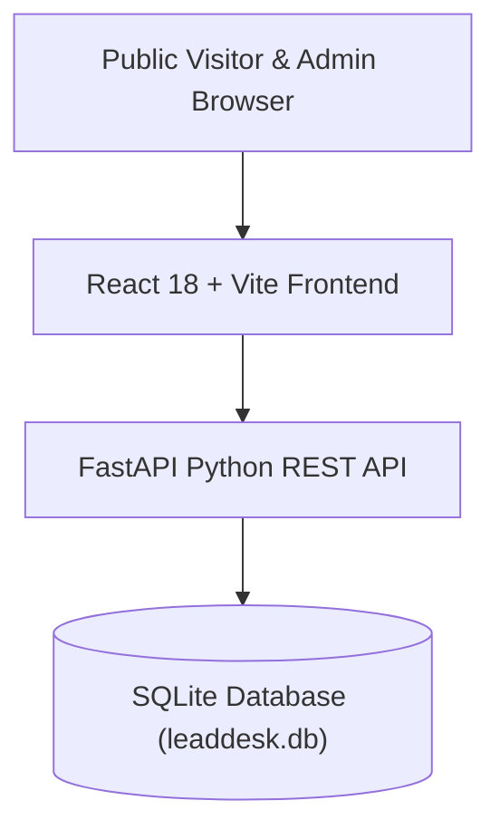

<div align="center">

# 🚀 LeadDesk Mini — Full-Stack CRM Platform

### *Built for Digital Heroes Full Stack Development Internship Task*

[](https://digitalheroesco.com)
[](https://fastapi.tiangolo.com/)
[](https://reactjs.org/)
[](https://www.sqlite.org/)
[](https://tailwindcss.com/)
[](https://jwt.io/)

**Candidate**: Divyansh Gahlaut  
**Repository**: [https://github.com/DivyanshGahlaut/LeadDesk-Mini](https://github.com/DivyanshGahlaut/LeadDesk-Mini)  
**Live Backend (Render)**: [https://leaddesk-mini-s9i4.onrender.com](https://leaddesk-mini-s9i4.onrender.com)  

</div>

---

## 🌐 Live Deployment Links

| Component | Platform | URL | Status |
| :--- | :--- | :--- | :--- |
| **Backend API** | Render | [`https://leaddesk-mini-s9i4.onrender.com`](https://leaddesk-mini-s9i4.onrender.com) |  |
| **API Docs (Swagger)** | Render | [`https://leaddesk-mini-s9i4.onrender.com/docs`](https://leaddesk-mini-s9i4.onrender.com/docs) |  |
| **Health Check** | Render | [`https://leaddesk-mini-s9i4.onrender.com/api/health`](https://leaddesk-mini-s9i4.onrender.com/api/health) |  |


---

## 📌 Executive Summary

**LeadDesk Mini** is a production-style, high-performance Customer Relationship Management (CRM) application built for capturing, validating, searching, and managing website project inquiries. It provides a public-facing lead capture portal and a secure, JWT-authenticated admin dashboard with real-time lead status tracking, multi-field search, SQLite persistence, and dual-layer validation.

---

## ✨ Key Features

### 🌐 1. Public Visitor Portal (`/`)
* **Apple 3D Aesthetics**: Dark background (`#020408`) with 3D glassmorphism elements and specular lighting.
* **Hero Banner**: Value proposition — *"Helping Businesses Build Better Websites"*.
* **Lead Capture Form**: Exactly 4 required fields:
  * `Name` (Full client name)
  * `Email` (Validated email address)
  * `Budget Range` (`Under $1000`, `$1000-$5000`, `Above $5000`)
  * `Message` (Project description and outline)
* **Client-Side Validation**: Instant checks before sending data (e.g. *"Please enter a valid email."*, *"Name cannot be empty"*).
* **Mandatory Verification Footer**: Visible credit line reading `Built for Digital Heroes Training Task` linked to [`https://digitalheroesco.com`](https://digitalheroesco.com).

### 🔐 2. Admin Authentication (`/login`)
* **Multi-Column Animated AuthPage**: Animated vector background paths (`FloatingPaths`), quick-fill buttons, and clean form layout.
* **Real JWT Token Auth**: Issues signed JWT access tokens upon valid credentials (`admin@leaddesk.com` / `admin123`).
* **Bcrypt Hashing**: Passwords encrypted with salted `bcrypt`.
* **Protected Routes**: Rejects unauthenticated access to `/admin` or APIs with `401 Unauthorized`.

### 📊 3. Admin Dashboard (`/admin`)
* **Real-time Metrics**: Metric cards showing counts for Total Leads, New, Contacted, and Closed.
* **Instant Multi-Field Search**: Search box filtering by Name, Email, Budget, Message text, or Status.
* **Database Status Toggle**: Dynamic status update dropdown (`New` ➔ `Contacted` ➔ `Closed`) calling `PUT /api/leads/{id}/status`.
* **Refresh Persistence**: All data is fetched directly from SQLite on page load; changes persist across browser refreshes.
* **Lead Detail Modal**: View full lead messages in a glassmorphism modal.

---

## 🛠️ Tech Stack & Architecture



| Layer | Technology | Purpose |
| :--- | :--- | :--- |
| **Frontend** | React 18 + Vite | Reactive single-page application framework |
| **Styling** | Tailwind CSS + Glassmorphism | Pitch-black UI with 3D specular lighting and animations |
| **UI Utilities** | Framer Motion + Lucide Icons | Smooth vector path animations and vector icons |
| **Backend** | Python FastAPI | Asynchronous RESTful API framework |
| **Server Validation** | Pydantic V2 | Server-side request sanitization & type enforcement |
| **Authentication** | PyJWT + Bcrypt | Bearer token access control & salted password hashing |
| **Database** | SQLite + SQLAlchemy ORM | Relational data storage (`leaddesk.db`) |
| **Testing** | FastAPI TestClient | Automated end-to-end API test suite |

---

## 📁 Repository Structure

```
LeadDesk-Mini/
├── backend/
│   ├── app/
│   │   ├── __init__.py
│   │   ├── main.py              # FastAPI application, CORS, routers, exception handlers
│   │   ├── config.py            # Environment variables & JWT config
│   │   ├── database.py          # SQLAlchemy SQLite connection session maker
│   │   ├── models.py            # Database tables (Lead, Admin)
│   │   ├── schemas.py           # Pydantic validation schemas (LeadCreate, Token, etc.)
│   │   ├── auth.py              # Bcrypt hashing & JWT token verification
│   │   ├── seed.py              # Initial admin account & demo leads seeder
│   │   └── routers/
│   │       ├── auth.py          # POST /api/auth/login, GET /api/auth/me
│   │       └── leads.py         # POST /api/leads, GET /api/leads, PUT status, search
│   ├── requirements.txt         # Backend Python dependencies
│   └── venv/                    # Python virtual environment
├── frontend/
│   ├── index.html               # Main HTML entry point
│   ├── package.json             # NPM dependencies & scripts
│   ├── vite.config.js           # Vite dev server, proxy & @ alias config
│   ├── tailwind.config.js       # Tailwind CSS theme settings
│   └── src/
│       ├── main.jsx
│       ├── App.jsx              # Routing & view switcher
│       ├── index.css            # Custom CSS & pitch-black glassmorphism tokens
│       ├── api/
│       │   └── client.js        # API service layer with JWT header injection
│       ├── lib/
│       │   └── utils.js         # cn() class merging helper
│       ├── components/
│       │   ├── Navbar.jsx       # Global translucent navigation header
│       │   ├── Hero.jsx         # Hero section & 3D CRM preview mockup card
│       │   ├── LeadForm.jsx     # Lead submission form with client validation
│       │   ├── Footer.jsx       # Mandatory Digital Heroes credit footer
│       │   ├── ui/
│       │   │   ├── button.jsx   # Shadcn Button component
│       │   │   ├── input.jsx    # Shadcn Input component
│       │   │   └── auth-page.jsx # Animated multi-column AuthPage component
│       │   └── admin/
│       │       ├── AdminNav.jsx # Admin dashboard header
│       │       ├── StatsCards.jsx # Metrics overview cards
│       │       └── LeadsTable.jsx # Interactive leads table with search & status toggle
│       └── pages/
│           ├── Home.jsx         # Public landing page
│           ├── Login.jsx        # Admin login page
│           └── Dashboard.jsx    # Admin dashboard page
├── render.yaml                  # 1-Click Render deployment configuration
├── vercel.json                  # Vercel frontend deployment configuration
├── test_backend.py              # Automated backend test suite
├── run.py                       # Single-command application runner
└── README.md                    # Project documentation
```

---

## 🗄️ Database Schema

### `leads` Table
| Column | Type | Constraints | Description |
| :--- | :--- | :--- | :--- |
| `id` | Integer | Primary Key, Auto-Increment | Unique lead identifier |
| `name` | String(100) | Not Null | Full client name |
| `email` | String(150) | Not Null, Indexed | Validated client email address |
| `budget` | String(50) | Not Null | Selected budget range (`Under $1000`, `$1000-$5000`, `Above $5000`) |
| `message` | Text | Not Null | Project description |
| `status` | String(20) | Default: `"New"` | Lifecycle status (`"New"`, `"Contacted"`, `"Closed"`) |
| `created_at` | DateTime | Default: `UTC Now` | Timestamp when lead was submitted |

### `admins` Table
| Column | Type | Constraints | Description |
| :--- | :--- | :--- | :--- |
| `id` | Integer | Primary Key, Auto-Increment | Unique admin identifier |
| `email` | String(150) | Unique, Not Null, Indexed | Admin email address |
| `hashed_password` | String(255) | Not Null | Salted bcrypt password hash |
| `created_at` | DateTime | Default: `UTC Now` | Account creation timestamp |

---

## 🔌 API Documentation

### Public Endpoints

#### 1. Submit Lead Form
* **Endpoint**: `POST /api/leads` (or `POST /lead`)
* **Request Body**:
```json
{
  "name": "Divyansh Gahlaut",
  "email": "divyansh@digitalheroes.com",
  "budget": "Above $5000",
  "message": "Need a custom full-stack CRM build for Digital Heroes task submission."
}
```
* **Response (201 Created)**:
```json
{
  "id": 1,
  "name": "Divyansh Gahlaut",
  "email": "divyansh@digitalheroes.com",
  "budget": "Above $5000",
  "message": "Need a custom full-stack CRM build for Digital Heroes task submission.",
  "status": "New",
  "created_at": "2026-07-24T15:35:00.000Z"
}
```

---

### Authentication Endpoints

#### 2. Admin Login
* **Endpoint**: `POST /api/auth/login` (or `POST /login`)
* **Request Body**:
```json
{
  "email": "admin@leaddesk.com",
  "password": "admin123"
}
```
* **Response (200 OK)**:
```json
{
  "access_token": "eyJhbGciOiJIUzI1NiIsInR5cCI6IkpXVCJ9...",
  "token_type": "bearer",
  "admin_email": "admin@leaddesk.com"
}
```

---

### Admin Protected Endpoints (Requires `Authorization: Bearer <token>`)

#### 3. Get All Leads
* **Endpoint**: `GET /api/leads` (or `GET /leads`)
* **Query Parameters**: `search` (optional), `status` (optional)

#### 4. Search Leads
* **Endpoint**: `GET /api/leads/search?q=Divyansh` (or `GET /search`)

#### 5. Update Lead Status
* **Endpoint**: `PUT /api/leads/{id}/status` (or `PUT /lead/{id}`)
* **Request Body**:
```json
{
  "status": "Contacted"
}
```

---

## 🚀 Quickstart & Local Setup

### Step 1: Clone Repository
```bash
git clone https://github.com/DivyanshGahlaut/LeadDesk-Mini.git
cd LeadDesk-Mini
```

### Step 2: Set Up Backend
```bash
# Create and activate virtual environment
python -m venv backend/venv
# Windows:
backend\venv\Scripts\activate
# Linux/macOS:
source backend/venv/bin/activate

# Install dependencies
pip install -r backend/requirements.txt

# Run automated test suite
python test_backend.py

# Launch FastAPI backend
python run.py
```
* Backend API: `http://127.0.0.1:8000`
* Swagger Interactive Docs: `http://127.0.0.1:8000/docs`

### Step 3: Set Up Frontend
In a new terminal window:
```bash
cd frontend
npm install
npm run dev
```
* Frontend Application: `http://localhost:3000`

---

## 🔑 Admin Credentials

* **Email**: `admin@leaddesk.com`
* **Password**: `admin123`

---

## 🤖 AI Usage Transparency Statement

> AI tools were used during initial architectural planning, reviewing Pydantic schema validation patterns, refining documentation, and drafting test cases. All source code implementation, UI component styling, database modeling, JWT authorization logic, end-to-end integration, and testing were executed, verified, and refined personally by Divyansh Gahlaut to ensure strict compliance with project requirements.

---

## 🏷️ Mandatory Verification Footer Notice

This application contains a visible, clickable credit line in the footer on the live public site reading:  
**"Built for Digital Heroes Training Task"** linked directly to [`https://digitalheroesco.com`](https://digitalheroesco.com).
